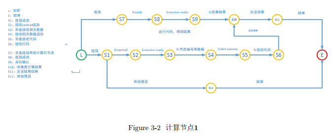

# high performance

## Table of contents
- [Abstract](#abstract)
- [Experiment content](#experiment-content)
- [Analysis](#analysis)
- [Implementation](#implementation)
- [Table and flow charts](#table-and-flow-charts)

### Abstract

This project mainly describes the use of python language to simulate parallel and distributed computing. Divide a large computing task into several small tasks, and then send these different small computing tasks to other computing nodes through a management node. Each computing node obtains the calculation results, and sends each calculation result to one of them. Computing nodes, summarized by the computing node, and finally send the result back to the control node.

### Experiment content

**Content**: Given a natural number range 2-n, calculate how many prime numbers there are in the range and the time consumed by the entire calculation process.

**Input**: need to calculate the maximum number of prime numbers n.

**Output**: the total number of prime numbers in the range s and the total consumption time t.

### Analysis

+ After the management node sends the computing code to each computing node, the computing code is the same for each computing node, so how does each computing node know its own computing task.

+ After each computing node completes the computing task, how to send the partial result of the calculation to the designated computing node.

+  How the specified computing node collects the results sent by other computing nodes.

+ How the designated computing node sends the final summary result to the management node.

### Implementation

This experiment is mainly implemented by Python language, which uses socket module, multithreading and message queue in Python language to simulate management node and calculation node. The management node is the client, and the calculation node is the server. There are 4 files in this experiment, respectively.

1. File `20185227018Control.py` as the management node.
2. File `20185227018Node.py` file for the compute node.
3. The code file `20185227018.py` that needs to be executed has two parameters, which are calculating the node number and the total number of nodes respectively.
4. `hosts.txt` file that holds the IP addresses of all compute nodes.

The IP address of the management node will be according to the hosts. TXT to each compute node connection request, after the connection is successful, will need to perform the code file 20185227018. Py, compute node number, total number of computing nodes, and collect other computing node partial results of the IP address of the specific nodes (it is assumed that the node number is 1) sent to the corresponding IP address compute nodes. Since the code file is the same for each compute node, the compute task of each compute node determines its own effort based on its number and the total number of compute nodes. For this experiment calculation number of primes, adopts uniform subdivision method, namely according to the need to compute the natural number, the total number of divided by the total number of computing nodes, which sequentially evenly into the scope of the corresponding then calculated by the various nodes are calculated respectively within the scope of their corresponding number (the one problem is that will lead to unbalanced load, namely the more to the back of the figure, the greater the its corresponding calculation time will be long).

In the process of running, the management node adopts multi-thread, that is, according to the number of IP addresses in hosts.txt, the corresponding threads are opened by loop respectively, and the corresponding threads are used to transfer relevant data. On all the compute nodes after passing the data, will open a thread to receive the final results, waiting for the compute node Numbers for 1 nodes (the compute nodes collect other local results and summary of the compute nodes) pass the final result to management node, node output the final calculated results by the management, namely the total number of primes, and output the total running time.

Since the code of each compute node is the same, and the tasks of a compute node numbered 1 and a compute node numbered not 1 are different, different tasks need to be determined according to different node Numbers. When the compute node is running, it first starts a thread to receive the data from the control node, and passes its number and total number of compute nodes as parameters to the code file 20185227018.py to execute and get the calculated results. Then decide on your next task based on your number.

+ Node number is 1, in addition to open a thread to receive data from the control node, and constantly monitor other computing nodes will send me partial results, if listening to have over other local calculation results, just open a thread to receive the local calculations, and place it in the message queue. At the same time, after their own calculation task is completed, the results are also put into the message queue. Finally, the total number of messages in the message queue is compared with the total number of all calculated nodes, if equal. Then take out and add all the results in the message queue to get the total prime number. And sends it to the control node. The corresponding thread is then terminated and waits for the next computation task.

+ The node number is not 1. After completing the corresponding calculation, open a client socket according to the IP address of node number 1 passed by the control node to connect the calculation node number \ TEXTBF {1} and pass the calculation result to it. The thread then terminates and waits for the next computation task.

After the control node receives the final calculation result from the calculation node numbered 1, it outputs the calculation result. The receiving thread terminates. At the same time, the total calculation time is displayed and the control node program ends.

We have the following table and flow chart.
### Table and flow charts

